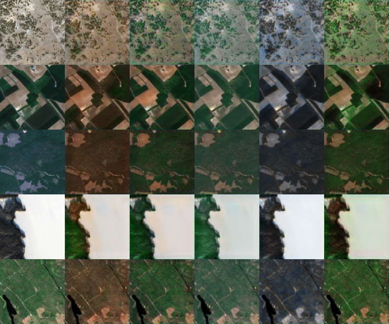

# `updaug`: TensorFlow implementation of DAugNet

This repository contains a TensorFlow implementation of the unsupervised domain-adaptation model in ["DAugNet: Unsupervised, Multi-source, Multi-target, and Life-long Domain Adaptation for Semantic Segmentation of Satellite Images"](https://arxiv.org/abs/2005.06216) by Tasar *et al*.


## What you need to get started

* A list of paths to image files
* A list of integers mapping each image to a domain. Expects domains to be numbered 0 to `num_domains-1`
* Corrresponding lists of images/domains for out-of-sample testing

## Usage

```python
import updaug


logdir = "/path/to/where/model/and/logs/should/be/stored/"

trainer = updaug.Trainer(trainfiles,
                            trainlabels,
                            testfiles,
                            testlabels,
                            filetype="png",
                            imshape=(128,128),
                            batch_size=32,
                            lr=1e-4
                            lr_decay=100000,
                            num_parallel_calls=4)

trainer.fit(100)

```

Both generator and discriminator will be saved in the log directory, as well as TensorBoard logs recording all of the loss components over time, autoencoder reconstruction loss on the 
out-of-sample dataset, and a visualization showing how a set of test images are mapped between domains.

The generator is a TensorFlow/keras model with two inputs- one `[None, None, 3]` input for images and a `[num_domains]` input for the domain to be mapped. Domains are one-hot encoded during training; during inference you can pass more complicated distributions here to make pseudo-random augmentations or interpolate between domains.

## TensorBoard visualization

Each row shows the first test image from each domain. The first column is the raw image, and every subsequent column is the generator output for a different domain:


